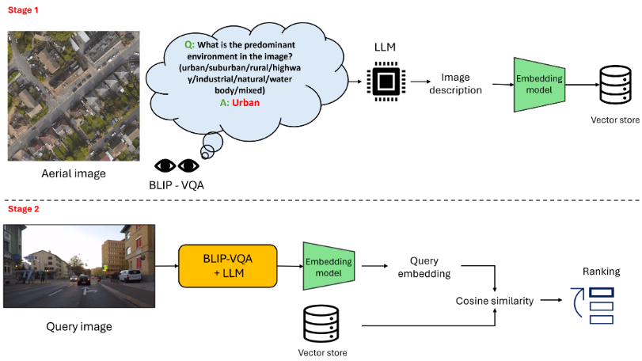

# GeoLLM: Evaluating Autonomous Vehicle Geolocalisation through Cross-View Language

## Overview
GeoLLM introduces an innovative approach to cross-view geo-localisation (CVGL), addressing the challenge of geo-positioning autonomous vehicles by correlating ground-level images with geo-tagged satellite imagery. Unlike traditional methods reliant on complex domain projections and low-level geometric features, GeoLLM harnesses the power of zero-shot vision language models (VLMs) to generate interpretable scene descriptions. These descriptions bridge the gap between views, enhancing generalisability across different geographic regions and offering resilience against the variability of real-world driving conditions.

## Key Contributions
- **Interpretable Cross-View Language Descriptions**: Our method bypasses the need for geometric projections by using natural language processing to describe key features of a scene, similar to how a human might interpret a view.
- **Robustness to Environmental Dynamics**: By leveraging VLMs, GeoLLM provides consistent performance despite changes in lighting, weather, and urban activity.
- **CVUK Dataset**: We introduce a comprehensive dataset encompassing diverse environmental conditions, including day-night cycles and seasonal changes, across major UK cities, to better assess CVGL systems.

## Video Demonstrations

To further illustrate the capabilities of GeoLLM and the potential of the CVUK dataset, we've prepared a GIF demonstration. This visualization showcases the system's performance across various environments and conditions, highlighting the practical applications of our research.

### CVUK Dataset

  
  

## Research Paper
For detailed insights and the methodology of GeoLLM, please refer to the paper
